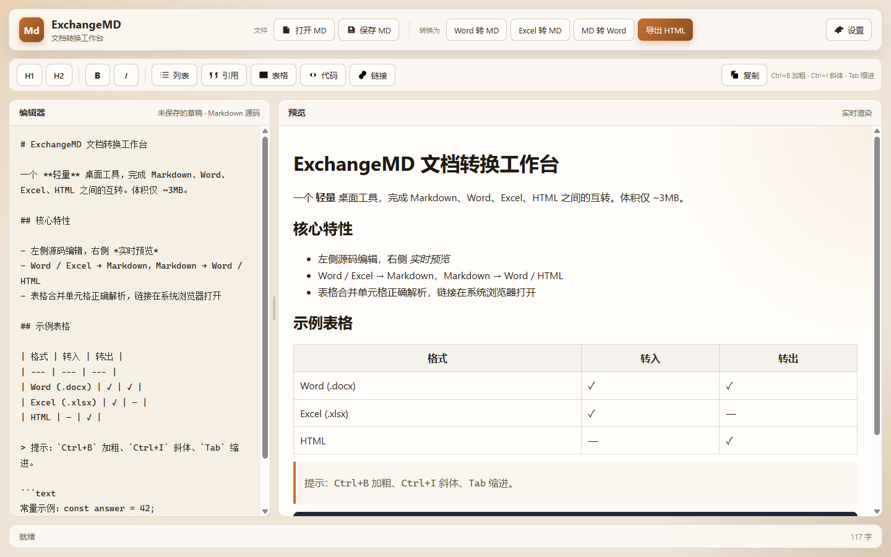
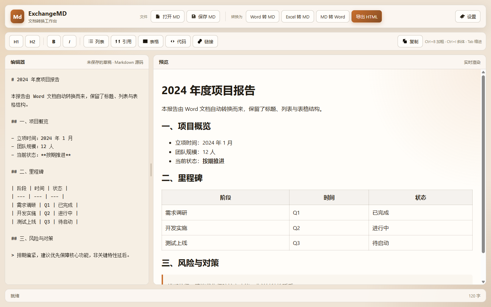
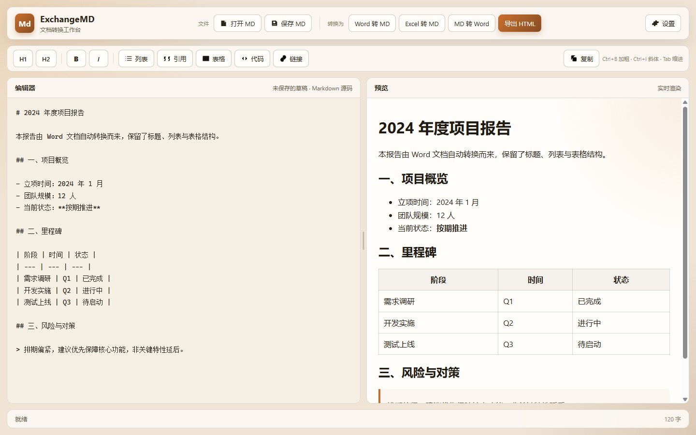
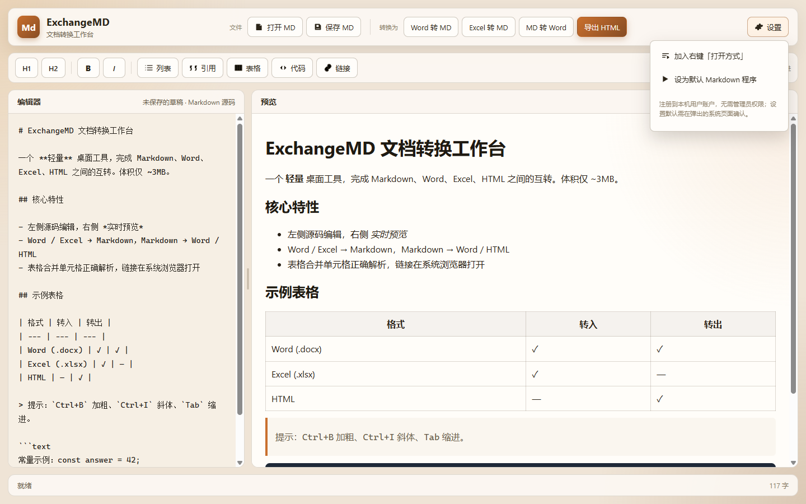

<div align="center">

# ExchangeMD

### 轻量级桌面文档转换工作台 · Markdown / Word / Excel / HTML 互转

Tauri v2 + 原生 TypeScript · 单文件 exe 仅 **~3 MB** · 免安装 · 全中文界面

  

[功能](#-核心功能) · [截图](#-截图) · [下载](#-下载与使用) · [自行构建](#-自行构建) · [快捷键](#-快捷键)

</div>

---

## 📌 项目简介

**ExchangeMD** 是一个跨格式文档转换的桌面小工具。在一个窗口里就能完成 **Markdown、Word（.docx）、Excel（.xlsx）、HTML** 之间的互相转换，并自带实时预览的 Markdown 编辑器。

它用 [Tauri v2](https://tauri.app/)（系统 WebView2）+ 原生 TypeScript 构建，**单文件 exe 仅约 3 MB**，免安装、不捆绑额外运行时。所有文档转换都在前端 JS 本地完成，启动即用、关闭即走。

---

## ✨ 核心功能

### 编辑器
- 左侧 Markdown **源码编辑** + 右侧**实时渲染预览**
- 工具栏一键插入：标题、加粗、斜体、列表、引用、表格、代码块、链接
- **可拖拽分隔条**调整编辑器 / 预览的宽度（比例自动记忆）
- 一键**复制** Markdown 源码、实时**字数统计**

### 文档转换（全部本地完成，文件不上传）
| 转换方向 | 说明 |
| --- | --- |
| **Word → Markdown** | 正确处理标题、列表、表格（含**合并单元格**）、图片标记 |
| **Excel → Markdown** | 每个工作表转为 Markdown 表格 |
| **Markdown → Word** | 生成真实 `.docx`，支持标题、有序/无序列表、表格、代码块、分隔线、**可点超链接**、嵌套加粗斜体 |
| **Markdown → HTML** | 生成带排版的独立 HTML 文档 |

### 系统集成
- **恢复上次状态**：下次打开自动恢复上次的编辑内容与文件名
- **右键「打开方式」**：一键把 ExchangeMD 加入 `.md` 的右键打开方式列表
- **设为默认程序**：注册到系统默认应用，双击 `.md` 直接用本程序打开
- 双击 `.md` / 通过右键打开，都能直接载入该文件

### 安全与体验
- 预览链接**在系统浏览器打开**，绝不接管应用窗口（避免误关导致退出）
- 预览 HTML 经 DOMPurify 消毒，防 XSS；全局启用 CSP
- 依赖已修复已知漏洞（SheetJS 升级至官方修复版 0.20.3）
- 尊重 `prefers-reduced-motion`、键盘焦点环、aria 无障碍标签

---

## 📷 截图

### 主界面：编辑 + 实时预览


### 文档转换效果（Word → Markdown，保留标题/列表/表格）


### 可拖拽分栏（拖动中间分隔条调整宽度）


### 系统设置：加入右键打开方式 / 设为默认程序


---

## 💾 下载与使用

1. 下载发布页里的 **`ExchangeMD.exe`**（单文件，约 3 MB）。
2. 双击即可运行，**无需安装**，可放任意目录、U 盘随身携带。
3. 首次使用建议点右上角 **⚙️ 设置**：
   - 「加入右键打开方式」→ 之后 `.md` 右键就能选 ExchangeMD 打开。
   - 「设为默认 Markdown 程序」→ 会打开系统设置页，确认即可设为默认。

> **运行依赖**：Windows 自带的 **WebView2 运行时**（Win10/Win11 通常已内置；少数老旧系统需从[微软官网](https://developer.microsoft.com/microsoft-edge/webview2/)安装）。

---

## 🛠 自行构建

### 环境要求
- [Node.js](https://nodejs.org/) ≥ 18
- [Rust](https://www.rust-lang.org/tools/install)（含 cargo）
- Windows 10/11（带 WebView2）

### 步骤
```bash
# 1. 安装依赖
npm install

# 2.（可选）重新生成应用图标
npx @tauri-apps/cli icon ./app-icon.png

# 3. 开发模式（热更新）
npx @tauri-apps/cli dev
#   或仅前端调试：npm run dev，浏览器访问 http://127.0.0.1:1420

# 4. 打包单文件 exe
npx @tauri-apps/cli build
#   产物：src-tauri/target/release/exchangemd.exe

# 5. 转换逻辑单元测试（不依赖 Tauri）
node --experimental-strip-types ./scripts/smoke-convert.mjs
```

---

## ⌨️ 快捷键

| 快捷键 | 功能 |
| --- | --- |
| `Ctrl + B` | 加粗 |
| `Ctrl + I` | 斜体 |
| `Tab` | 插入两个空格 / 给选中行加缩进 |
| `Shift + Tab` | 反缩进 |
| `Esc` | 关闭设置菜单 |

---

## 📂 项目结构

```
├─ index.html              界面结构（全中文）
├─ package.json            前端依赖与脚本
├─ vite.config.ts          Vite 配置（dev 端口 1420）
├─ app-icon.png            图标源文件（脚本生成，可派生全套图标）
├─ docs/screenshots/       README 截图
├─ scripts/
│  └─ gen-icon.mjs         生成图标源 PNG（无第三方依赖）
│  └─ smoke-convert.mjs    转换逻辑冒烟测试
├─ src/                    前端
│  ├─ main.ts              界面交互、文件操作、系统集成
│  ├─ style.css            样式
│  └─ lib/
│     ├─ markdown.ts       Markdown 渲染 / HTML 导出
│     ├─ convert.ts        docx / xlsx / md 互转（含表格合并解析）
│     └─ io.ts             文件读写（封装 Tauri 对话框 + Rust 命令）
└─ src-tauri/              Rust 外壳
   ├─ Cargo.toml           依赖（release 体积优化：opt-level=z, lto, strip）
   ├─ tauri.conf.json      窗口 / CSP / 打包配置
   ├─ capabilities/        权限
   ├─ icons/               应用图标
   └─ src/main.rs          文件读写、文件关联、打开外部链接
```

---

## 🔐 关于「设为默认程序」的说明

Windows 8 以后，系统用哈希保护「默认应用」设置，**任何程序都无法静默把自己设为默认**（直接写注册表会被系统重置，这是微软的安全设计）。因此本程序的「设为默认 Markdown 程序」会：

1. 注册好 ProgID（让 ExchangeMD 出现在默认应用列表里）；
2. **自动打开系统「默认应用」设置页**，由你点一下确认。

这是 Windows 限制下唯一可靠、合规的方式。

---

## 🧰 技术栈

- **外壳**：[Tauri v2](https://tauri.app/) (Rust) + 系统 WebView2
- **前端**：原生 TypeScript + [Vite](https://vitejs.dev/)
- **转换库**：[mammoth](https://github.com/mwilliamson/mammoth)（docx→HTML）、[SheetJS](https://sheetjs.com/)（xlsx）、[docx](https://github.com/dolanmiu/docx)（生成 docx）、[turndown](https://github.com/mixmark-io/turndown) + [turndown-plugin-gfm](https://github.com/domchristie/turndown-plugin-gfm)（HTML→Markdown）
- **渲染**：[markdown-it](https://github.com/markdown-it/markdown-it) + [DOMPurify](https://github.com/cure53/DOMPurify)

---

## 📄 许可证

本项目采用 **MIT License** 开源，详见 [LICENSE](LICENSE)。

> MIT 协议允许任何人**自由使用、复制、修改、合并、发布、分发甚至商用**本项目的代码，只需在副本中保留原始版权声明与许可声明即可。本项目不提供任何担保，作者不对使用后果承担责任。

项目所引用的第三方库（Tauri、markdown-it、mammoth、SheetJS、docx、turndown、DOMPurify 等）均遵循各自的许可证。
